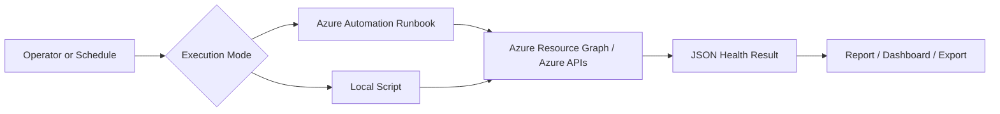

# VM Health Check Automation

## Overview

The VM Health Check Automation validates key operational signals for Azure virtual machines and produces a structured result that can be used for reporting, troubleshooting, or readiness validation.

## Business Value

This automation helps operations teams quickly determine whether virtual machines are healthy, reachable, monitored, and ready for operational activities such as patching, backup validation, or incident response.

## Use Cases

- Daily VM health reporting
- Pre-patching readiness checks
- Post-maintenance validation
- Incident triage
- Operations dashboard data collection

## Implementations

| Variant | Description | Best For |
|---|---|---|
| Azure Automation Runbook | Executes inside Azure Automation using managed identity | Scheduled production checks |
| Local Script | Executes from an operator workstation or pipeline agent | Testing, troubleshooting, ad hoc validation |

## Architecture



## Inputs

```json
{
  "subscriptionId": "00000000-0000-0000-0000-000000000000",
  "resourceGroupName": "rg-prod-app",
  "includePowerState": true,
  "includeAgentStatus": true
}
```

## Outputs

```json
{
  "vmName": "vm-prod-001",
  "resourceGroup": "rg-prod-app",
  "powerState": "VM running",
  "provisioningState": "Succeeded",
  "monitoringAgent": "Installed",
  "healthStatus": "Healthy"
}
```

## Required Permissions

| Scope                               | Permission                                                |
| ----------------------------------- | --------------------------------------------------------- |
| Subscription or Resource Group      | Reader                                                    |
| Log Analytics Workspace             | Log Analytics Reader, if querying heartbeat or agent data |
| Automation Account Managed Identity | Reader on target scope                                    |


## Runbook Version

Location: `automations/vm-health-check/runbook/vm-health-check.runbook.ps1`

Recommended when:
- Execution must be scheduled
- Managed identity is preferred
- No local credentials should be used
- Results are integrated into Azure-native operations

## Local Script Version

Location: `automations/vm-health-check/local-script/vm-health-check.local.ps1`

Recommended when:
- Testing logic before publishing as a runbook
- Running one-time checks
- Executing from a DevOps pipeline
- Debugging customer-specific issues

## Deployment Notes

## Version History

| Version | Description                            |
| ------- | -------------------------------------- |
| v1.0.0  | Initial local script                   |
| v1.1.0  | Added Azure Automation Runbook version |
| v1.2.0  | Added structured JSON output           |
| v1.3.0  | Added readiness classification         |
